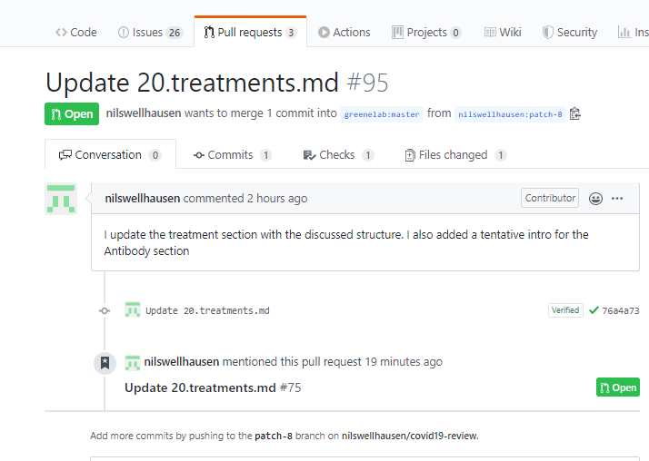
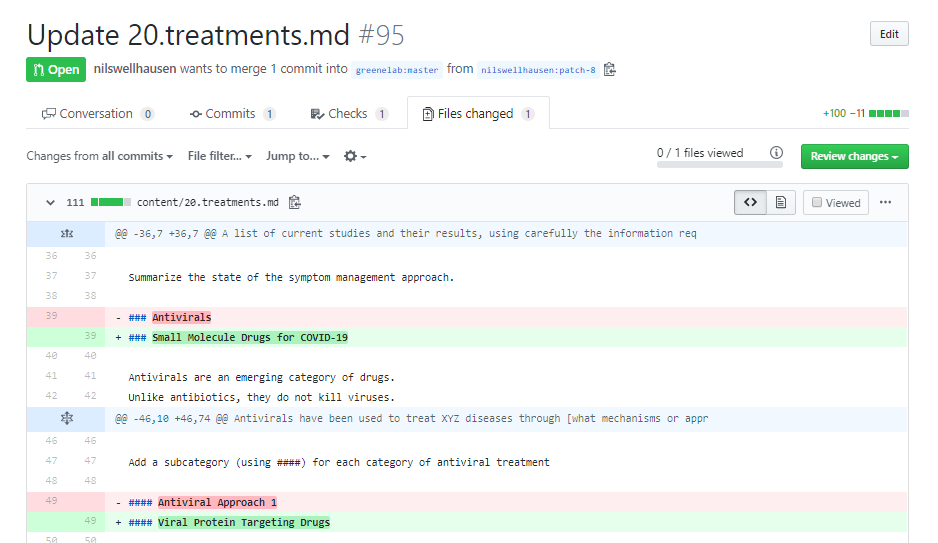
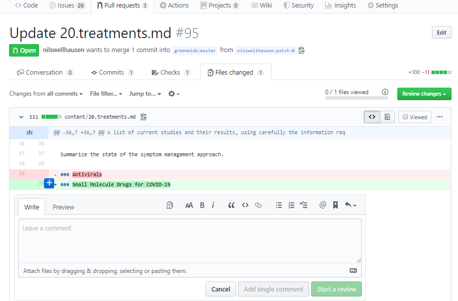
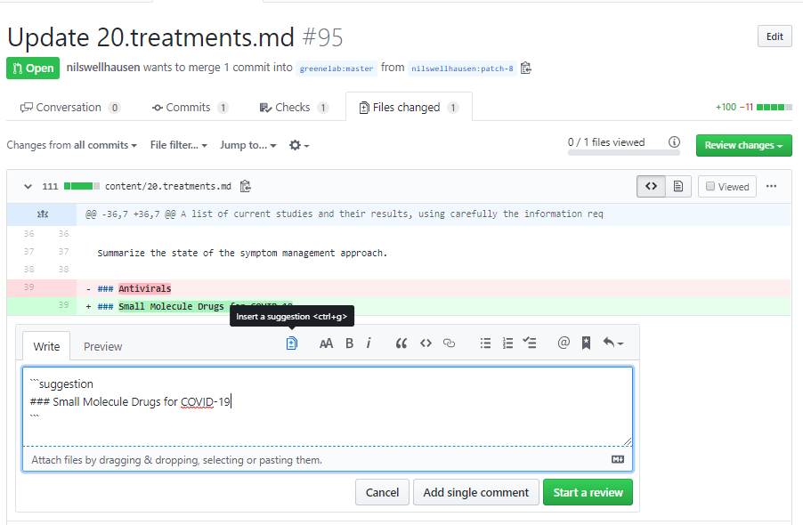
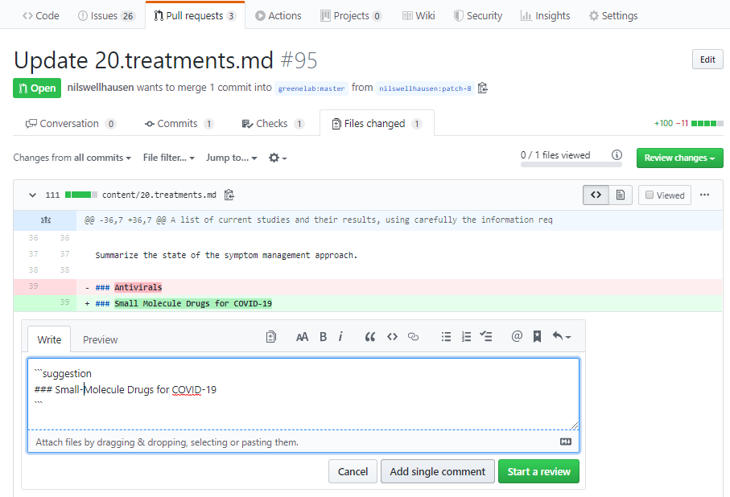
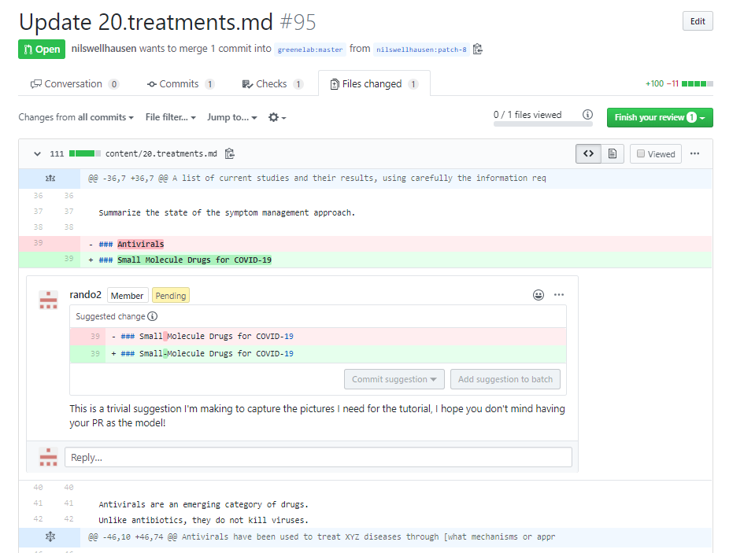

# How to Contribute

## What to Contribute

We're looking for contributors from a variety of backgrounds -- not just biologists and other scientists interested in reading and synthesizing the literature, but people with experience running collaborative literature reviews or managing large projects in GitHub have also been extremely helpful.

To look for ideas of what is currently needed, check [here](https://github.com/greenelab/covid19-review/issues/34) or look through the open [Issues](https://github.com/greenelab/covid19-review/issues) until you find a topic that interests you.

## First Step

First, go [here](https://github.com/greenelab/covid19-review/issues/17) and tell us a bit about yourself per the questions at the top.

## Suggesting a Paper

One of the best things you can do is suggest a paper for review (even if it's outside of your own field but you think it seems interesting).
To suggest a paper, choose the appropriate [New Paper Template](https://github.com/greenelab/covid19-review/issues/new/choose), depending on whether the paper pertains to therapeutics, diagnostics, or another category, and fill in as many sections as you feel comfortable responding to.

## Summarizing a Paper

If you find a [suggested paper](https://github.com/greenelab/covid19-review/labels/New%20Paper) you feel comfortable evaluating, copy the questions from the template and fill them out as best you can.
Ideally we'd like two people to look at each paper.
It's OK if you can't evaluate everything.
Feel free to mention what expertise you think would complement yours.

## How to Contribute Text

1. First, go [here](https://github.com/greenelab/covid19-review/issues/17) and tell us a bit about yourself. 
2. Then, you can look through [current document](https://greenelab.github.io/covid19-review/) or at each section in the [content](https://github.com/greenelab/covid19-review/tree/master/content) folder.
3. To contribute suggestions or changes, beginners should follow [these instructions](INSTRUCTIONS.md).
Experienced git users can find a suggested workflow and manubot build instructions [here](INSTRUCTIONS.md#command-line-users).

[Click here](https://github.com/greenelab/covid19-review/blob/master/USAGE.md#manuscript-metadata) for formatting instructions.

Once the answer to the question "did you change the contents of the repository in some way that was meaningful (i.e., not just adding an apostrophe or fixing typos)?" is yes, please add yourself to the author list by following the Authorship Guidelines below.

## Reviewing Someone's Pull Request

Reviewing text that other contributors submit is one of the most important ways you can help.
Because we are all coming from different fields, there is value in having as many people as possible look at each submission to help new ideas percolate.
Right now, we are asking for at least two people to look at each new piece of text.
Some things you can check for when you review someone's pull request:
- Does it pass all manubot checks? ([See here for more information](https://github.com/greenelab/covid19-review/blob/master/INSTRUCTIONS.md#how-can-i-see-my-change))
- Is there an issue opened for every paper cited?
- To the extent that the text overlaps with your own area of expertise, is it correct? 
Are there any ambiguities, oversimplifications, or topics you think should be clarified?
- Do you have questions about any of the scientific content inside or outside of your field?
- Will the text be easy for someone from a different scientific discipline to understand?

If you have questions about the topic broadly, or want to discuss theory, how it may relate to other sections of the paper or to other fields, etc., you are encouraged to open an issue and start this discussion!
One of the goals of this project is to get scientists from different disciplines working together and thinking creatively about the problems related to COVID-19.
You can tag a PR in an issue by typing "\#" and the number of the PR (beside the title). 
(For example, #100 will call up the PR that added a a code of conduct).

### The How-To of Review

When you open someone's pull request, there are a few ways you can propose suggestions or changes.

Here we will walk you through our preferred method.

**Step One:** Navigate to the "Files" tab so that you can see the changes the user is proposing.

**Step Two:** Locate a line where you'd like to suggest a change, hover over it so that a blue "+" appears, and then click the "+"

**Step Three:** Click the page symbol (in blue here) to insert a suggestion

**Step Four:** Propose in-line edits

Anything typed within the code formating block (the section sandwiched between \`\`\`), as in the picture above, will be considered an inline change. 
You can also type a separate comment outside of the code for block (i.e., before the first \`\`\` or after the second \`\`\`).

**Step Five:** Click the green "Start a Review" button below the comment box to finalize your suggestion (although you can go back and edit it by clicking the three dots next the smiley face that you'll see beside the proposed change in the image for step 6).
Starting a Review means that all of your suggestions will be grouped together for easier viewing -- we encourage this!
Now repeat steps 2-4 for all of the changes you'd like to propose.

**Step Six:** When you're finished proposing changes, click the large green "Finish Your Review" in the upper right corner

Thank you for reviewing a submission! 
If you have questions about this tutorial, please open an issue to let us know what's confusing, or ask for help on the [project gitter](https://gitter.im/covid19-review/community).

## Authorship Guidelines

We're using the [ICMJE Guidelines](http://www.icmje.org/recommendations/browse/roles-and-responsibilities/defining-the-role-of-authors-and-contributors.html) for determining authorship.
To add yourself to the author list following a meaningful contribution to the repository, please:
1. Look up the [CRediT Taxonomy](https://casrai.org/credit/) and determine which Contributor Role(s) best characterizes your contribution.
(You can always update this later if you take on more responsibilities)
2. Fill in your [author information](USAGE.md#manuscript-metadata) by initiating a [pull request](INSTRUCTIONS.md#how-to-contribute) on [this file](content/metadata.yaml)

## Chat Platform

We're using [gitter](https://gitter.im) for informal conversations. 
Our group is called [covid19-review](https://gitter.im/covid19-review/community).
It is linked to your GitHub credentials, so you won't need to make a new account.
